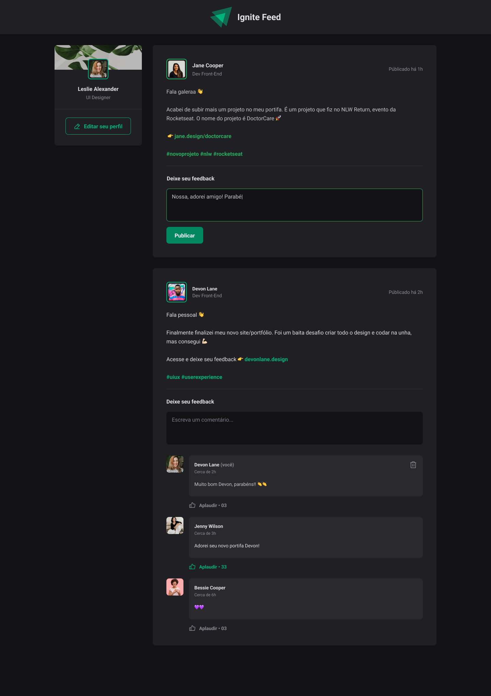

<h1 align="center">
  
</h1>

<p align="center">
  

  
  
  <a href="https://github.com/pabloxt14/Ignite-Feed/commits/master">
    
  </a>
    
   

   <a href="https://github.com/pabloxt14/Ignite-Feed/stargazers">
    
  </a>
</p>

<p>
  
</p>

<h4 align="center"> 
	🚀 Aplicação finalizada 🚀
</h4>

<p align="center">
 <a href="#-about">About</a> |
 <a href="#-deploy">Deploy</a> |
 <a href="#-layout">Layout</a> | 
 <a href="#-how-it-works">How It Works</a> | 
 <a href="#-technologies">Technologies</a> | 
 <a href="#-author">Author</a> | 
 <a href="#-license">License</a>
</p>


## 💻 About

O Ignite Feed é um projeto de exemplo de um feed de rede social, onde se tem os posts dos usuários, tags do post e comentários de outros usuários no post, dados típicos de uma publicação de rede social. 

Caso goste do projeto marque a estrelinha⭐ e compartilhe para me ajudar 👍, e me siga para ver outros projetos meus.

---

## 🔗 Deploy

O deploy da aplicação pode ser acessada através do seguinte link: <a target="_blank" href="https://ignite-feed-lovat.vercel.app/">Link</a>

---

## 🎨 Layout

Você pode visualizar o layout do projeto através [desse link](https://www.figma.com/file/RSjXXcIse9wSFe6CAv6kNc/Ignite-Feed/duplicate). É necessário ter conta no [Figma](https://www.figma.com/) para acessá-lo.

Veja uma demonstração visual das principais telas da aplicação:

<p align="center">
  
</p>

---

## 🚀 How it works

### Pré-requisitos

Antes de baixar o projeto você vai precisar ter instalado na sua máquina as seguintes ferramentas:

* [Git](https://git-scm.com)
* [NodeJS](https://nodejs.org/en/)
* [Yarn](https://yarnpkg.com/) ou [NPM](https://www.npmjs.com/)

Além disto é bom ter um editor para trabalhar com o código como [VSCode](https://code.visualstudio.com/)

### Clonando e Executando

Passo a passo para clonar e executar a aplicação na sua máquina:

```bash
# Clone este repositório
$ git clone git@github.com:pabloxt14/Ignite-Feed.git

# Acesse a pasta do projeto no terminal
$ cd Ignite-Feed

# Instale as dependências
$ npm install

# Execute a aplicação em modo de desenvolvimento
$ npm run dev

# A aplicação inciará em alguma porta disponível que poderá ser acessada pelo navegador
```

---

## 🛠 Technologies

As seguintes principais ferramentas foram usadas na construção do projeto:

- **[Vite](https://vitejs.dev/)**
- **[ReactJS](https://reactjs.org/)**
- **[TypeScript](https://www.typescriptlang.org/)**
- **[CSS-Modules](https://github.com/css-modules/css-modules)**
- **[Phosphor Icons](https://phosphoricons.com/)**
- **[date-fns](https://date-fns.org/docs/Getting-Started)**

> Para mais detalhes das dependências gerais da aplicação veja o arquivo [package.json](./package.json)

---

## ✍ Author


[](https://www.linkedin.com/in/pabloalan/)

[](mailto:pabloxt14@gmail.com)

---

## 📝 License

Este projeto está sob a licença MIT. Consulte o arquivo [LICENSE](./LICENSE) para mais informações

Feito com 💜 por Pablo Alan 👋🏽 [Entre em contato!](https://www.linkedin.com/in/pabloalan/)